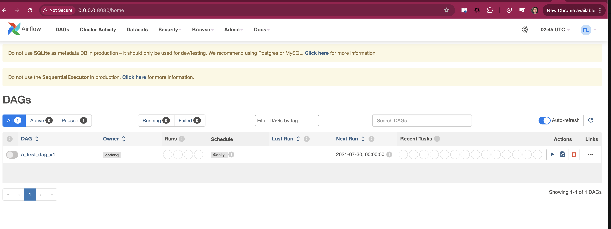

# Airflow installation using Pip
- Check Python3 version
  - `python3 --version`
- Create venv and activate it
  - `python3 -m venv py_env`
  - `source py_env/bin/activate`
- Install Airflow using pip
  - ```python
        pip install 'apache-airflow==2.10.5' \
        --constraint "https://raw.githubusercontent.com/apache/airflow/constraints-2.10.5/constraints-3.9.txt"
    ```
- Set `AIRFLOW_HOME` to current project directory and initialize airflow SQLite DB. 
  - Note: Do not use SQLite as metadata DB in production – it should only be used for dev/testing. We recommend using Postgres or MySQL. Click here for more information.
  - `export AIRFLOW_HOME=/Users/shradhakhard/development/airflow_tutorial`
  - `airflow db init`
- Create a user before starting the server 
  - ```
    airflow users create --username admin --firstname First --lastname Last --role Admin --email admin@example.org
    ```

    create a password `admin`

    retype password `admin`
- Start the server on port 8080 and scheduler
  - In one terminal `airflow webserver -p 8080` or  `airflow webserver &`
  - In another terminal again export the `AIRFLOW_HOME` and set the `venv`
    - `export AIRFLOW_HOME=/Users/shradhakhard/development/airflow_tutorial`
    - `source py_env/bin/activate`
    - `airflow scheduler`
- Open the Airflow UI on a browser 
  - http://0.0.0.0:8080/home
  - Username: admin
  - Password: admin 


# Airflow Config 
- Executors
  - [Executors](https://airflow.apache.org/docs/apache-airflow/2.10.5/core-concepts/executor/index.html) are the mechanism by which task instances get run.
  - Executors are set by the executor option in the [core] section of the configuration file.
  - Check which executor is currently set
    - `airflow config get-value core executor`
  - Note: The `LocalExecutor` cannot be used with `SQLite`. Airflow requires a database that supports parallel connections when using `LocalExecutor` or `CeleryExecutor`
  - When using Postgres we can use `LocalExecutor` to run tasks locally
    - When used, Airflow tasks are run locally within the scheduler process
  - To change current executor export the executor name 
    - `export AIRFLOW__CORE__EXECUTOR=SequentialExecutor`
      OR 
    - `export AIRFLOW__CORE__EXECUTOR=LocalExecutor`
- To get the airflow config values 
  - List all `airflow config list`
  - List defaults `airflow config list --defaults`
  - to check the default dags folder location `airflow config get-value core dags_folder`
    

# Add your first Dag 
- Ensure the `dags_folder` is set as per your requirement
  - `airflow config get-value core dags_folder`
  - If not change it 
    - either edit the `airflow.cfg` file and restart the server 
    - or use `export AIRFLOW__CORE__DAGS_FOLDER=/Users/shradhakhard/development/airflow_tutorial/dags` 
  - You should see your dag listed on Airflow UI 
  -  
